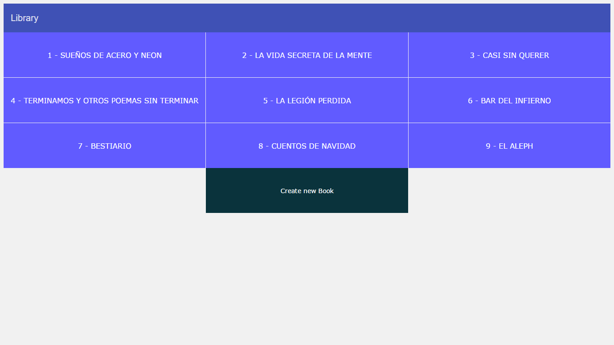
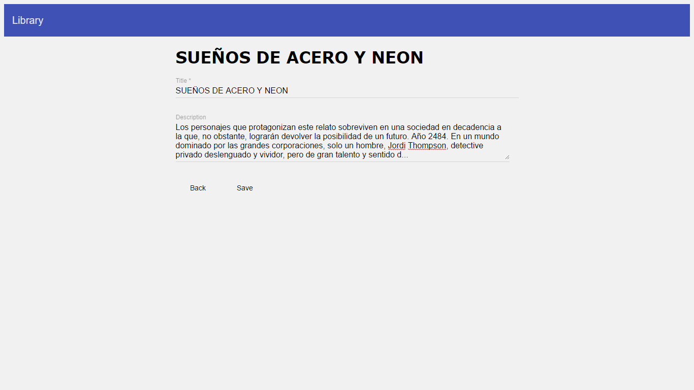
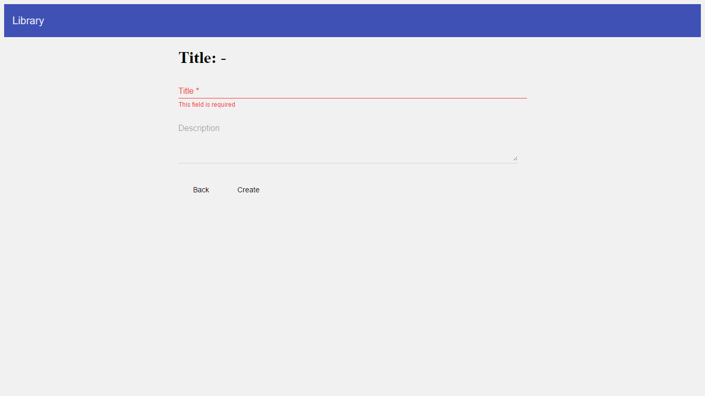
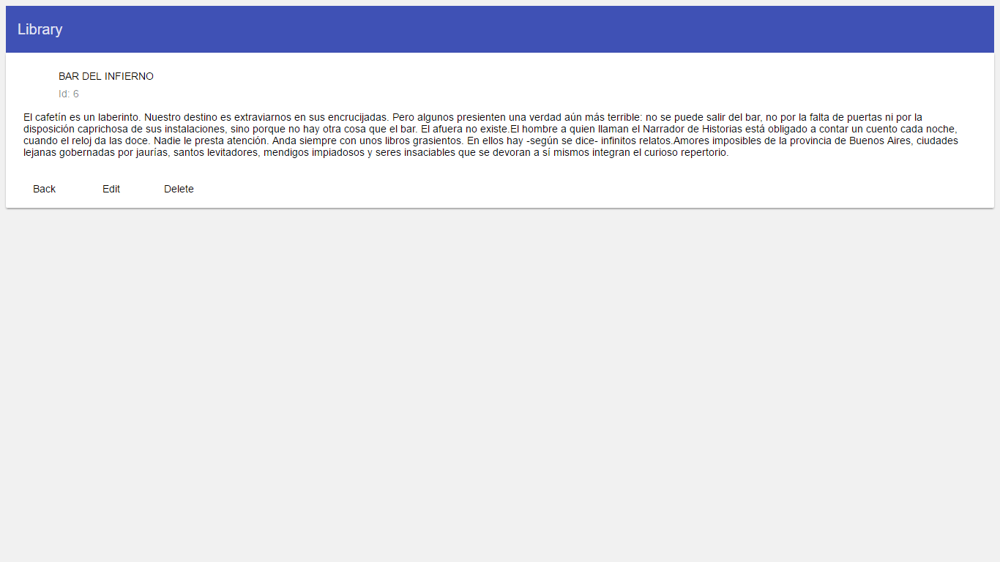

# Library

## Project using Angular2, Angular Material2 & node.js

### Getting started
* __Previous Requirements.__   
  * Node version 6.8.0.
  * Npm version 4.2.0.
  
  * __Here you have the instructions to use the app.__   
  * Clone the repository using git clone .
  * Type the command 'node app.js'.
  * The app will be running in http://localhost:4200 .
  
  ### Screenshots
* __Book List__
    
    
* __Book Edit__
    

* __Book Create__
    
    
* __Book Details__
    
